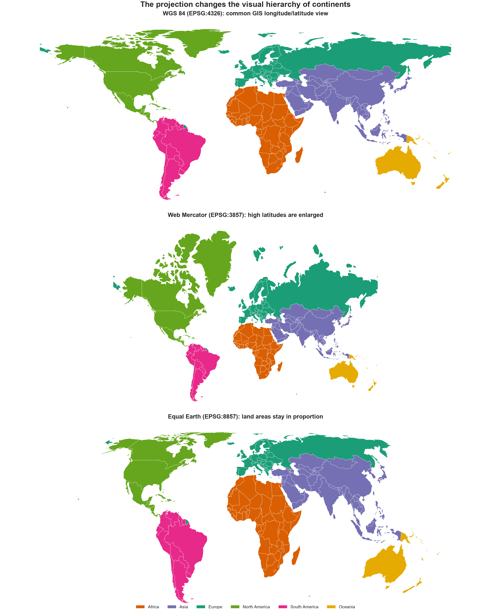
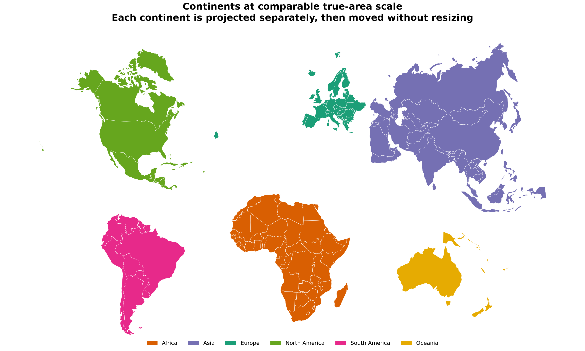
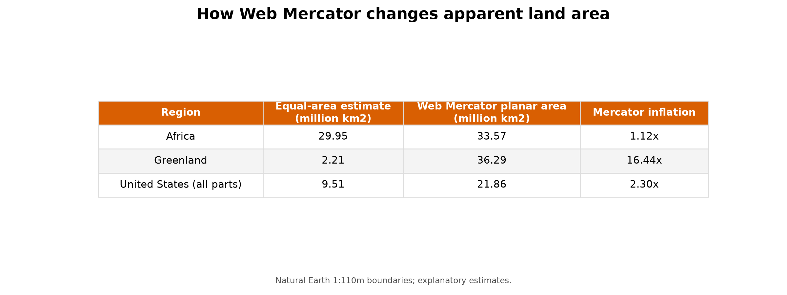
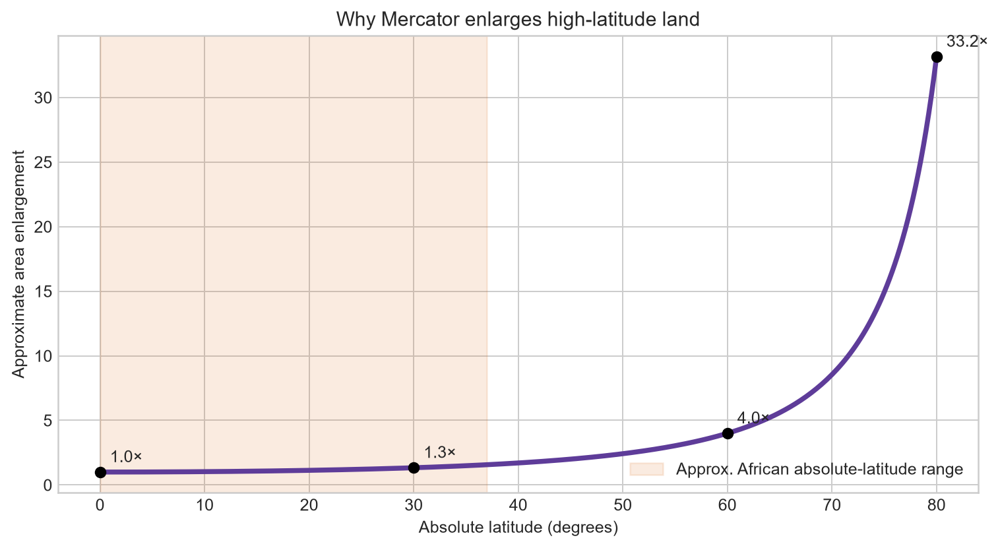
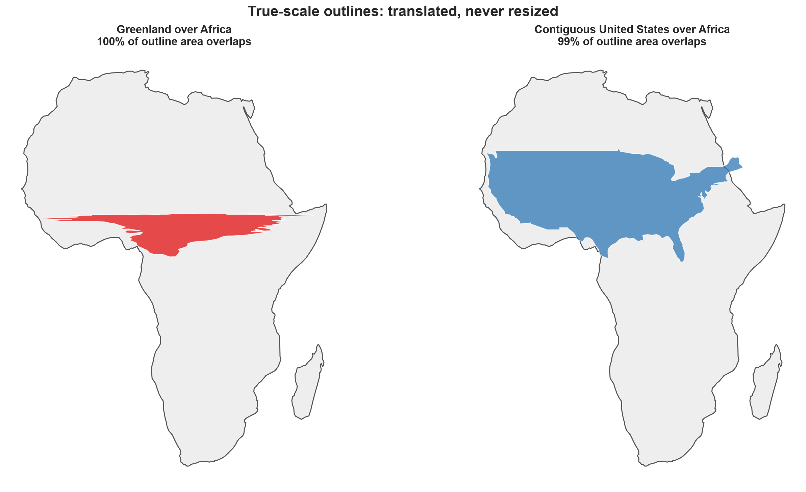
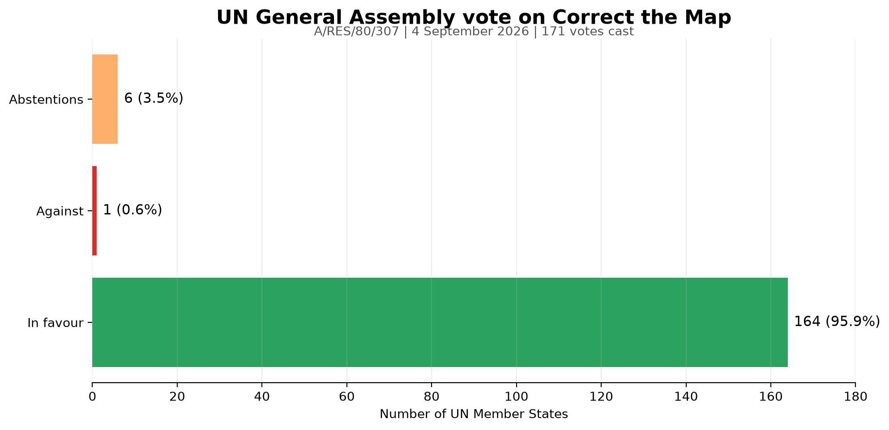

# Correct the Map: Africa's True Relative Size

A reproducible geospatial analysis of how WGS 84, Web Mercator, and Equal Earth change the visual relationship between Africa and other regions. The project combines maps, area measurements, true-scale overlays, and the 2026 UN vote on the **Correct the Map** resolution.

> Africa is not reduced by Mercator. High-latitude regions are enlarged much more strongly, making Africa look too small by comparison.

## Key findings

| Region | Equal-area estimate | Area measured on a Web Mercator map | Mercator enlargement |
|---|---:|---:|---:|
| Africa | 29.95 million km² | 33.57 million km² | 1.12× |
| Greenland | 2.21 million km² | 36.29 million km² | 16.44× |
| United States (all parts) | 9.51 million km² | 21.86 million km² | 2.30× |

- Africa is approximately **13.6 times the area of Greenland**.
- Africa is approximately **3.8 times the area of the contiguous United States** in this generalized dataset.
- When area is measured directly on the Web Mercator map, Africa appears only about **0.9 times as large as Greenland**.
- `EPSG:4326` is a geographic coordinate system, not an equal-area projection; its familiar rectangular GIS display also distorts size and shape.
- Equal Earth (`EPSG:8857`) preserves relative area and is better suited to global comparisons of magnitude.

## Visual results

### One dataset, three world views



### True-area continent layout

This layout projects every continent separately with a local equal-area map, then moves the pieces without resizing them. This gives Australia and the other continents clearer shapes while keeping their areas comparable. It is not a continuous world projection, so the gaps and distances between continents are illustrative rather than geographic.



#### How the separate-and-fuse method works

1. **Separate the data:** countries are grouped into Africa, Asia, Europe, North America, South America, and Oceania.
2. **Project each continent locally:** each group uses its own Lambert Azimuthal Equal Area projection, centred near that continent. An equal-area projection keeps area correct, while a nearby centre helps reduce visible shape changes.
3. **Keep one scale:** every projected group uses metres. Nothing is enlarged or reduced after projection, so the continent areas remain directly comparable.
4. **Find each centre:** the code calculates the centre of every continent's projected bounding box.
5. **Move without resizing:** each group is moved to a chosen display position using `x_new = x + dx` and `y_new = y + dy`. This translation changes location only; it does not change shape or area.
6. **Fuse the layers:** the translated groups are drawn on one set of axes with the same colours, borders, and scale.

This method reduces the strong edge-of-map shape changes seen in a single world projection, but it does not create a distortion-free world map. Shapes can still change within each local projection. The final gaps, directions, and distances between continents are designed for comparison and are not geographically measurable. Russia is grouped with Asia in this layout so Europe and Asia can be displayed as separate visual regions.

### Area-statistics summary



### Mercator area enlargement by latitude



### True-scale outlines over Africa

The outlines are moved over Africa but never resized. Both panels use the same equal-area map projection.



### UN General Assembly vote



The General Assembly adopted `A/80/L.104` as **resolution `A/RES/80/307`** on 4 September 2026 by **164 votes in favour, 1 against, and 6 abstentions**. The United States cast the only vote against. Estonia, Georgia, Lithuania, the Republic of Moldova, Serbia, and Ukraine abstained.

The screenshot headed “Decade of culture for sustainable development” belongs to a separate vote held during the same meeting:

| Subject | Draft | Resolution | Vote |
|---|---|---|---:|
| Correct the Map | `A/80/L.104` | `A/RES/80/307` | 164–1–6 |
| Decade of Culture for Sustainable Development | `A/80/L.102` | `A/RES/80/308` | 174–1–0 |

## Why it matters

- **African Union:** shows broad international support for the AU's call to represent Africa fairly and update school curricula.
- **Schools and publishers:** encourages equal-area world maps and lessons showing that every flat map has limits.
- **UN and public bodies:** gives them a clear reason to use fairer world maps in reports, statistics, and learning materials.
- **Technology and media:** encourages equal-area options for world views while keeping Mercator for navigation and detailed local maps.
- **Mapmakers and analysts:** reminds them to use an equal-area projection when measuring or comparing land area.

The resolution is a recommendation, not a law. It does not ban Mercator, force anyone to use one map, or change any country's borders.

## Reproduce the analysis

Open [`correct_the_map_africa.ipynb`](correct_the_map_africa.ipynb) and run all cells from top to bottom.

```bash
pip install geopandas shapely pyproj matplotlib pandas
```

The first run downloads Natural Earth 1:110m boundaries to `data/`; later runs use the cached file.

## Method and limits

- `EPSG:6933` supplies equal-area measurements.
- `EPSG:3857` supplies the areas measured on the Web Mercator map.
- The fused continent view uses a separate Lambert Azimuthal Equal Area projection for each continent, followed by translation without scaling.
- Overlay geometries are translated without scaling or rotation.
- Natural Earth 1:110m boundaries are generalized, so the results are explanatory estimates rather than official statistics.
- No flat map preserves area, shape, direction, and distance everywhere. Projection choice must follow purpose.

## Sources

- [African Union Assembly Decision 959 (XXXIX)](https://au.int/sites/default/files/decisions/46188-Assembly_Decisions_E.pdf)
- [African Union communiqué, 4 September 2026](https://www.au.int/en/pressreleases/20260904/communique-auc-chairperson-adoption-correct-map-resolution)
- [UN General Assembly meeting coverage and explanations of vote](https://press.un.org/en/2026/ga12779.doc.html)
- [Official agenda for the 114th plenary meeting](https://igov.un.org/ga/plenary/80/meetings?document=A%2F80%2FL.104)
- [UN draft resolution A/80/L.104](https://docs.un.org/A/80/L.104)
- [Natural Earth cultural vectors](https://www.naturalearthdata.com/downloads/110m-cultural-vectors/)
- [Equal Earth, EPSG:8857](https://epsg.io/8857)

## Social version

See [`LINKEDIN.md`](LINKEDIN.md) for a concise, paste-ready post and suggested carousel order.
